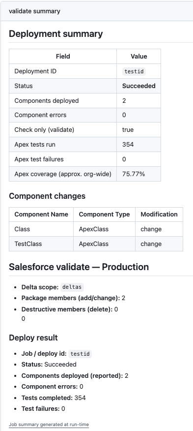

# SF Pipeline

Deploy salesforce metadata from a sandbox to production. This repo contains github actions that will validate and deploy changes from a pull request (PR).

## Features

- Validate changes by opening a PR
- Deploy changes by merging a PR
- Deployment summary
- Delta deployments



## Install

Uses npm to install

```
npx shadcn@latest add jawills/sf-pipeline/delta-ci-setup
```
